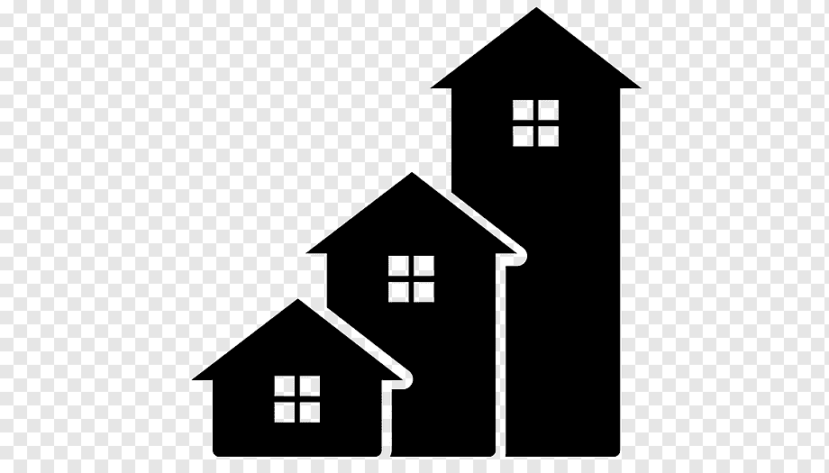

    

      

        
        <h2>Pilih Tipe Ruang Tamu Idealmu!</h2>
      

      

        

          

            
          

          
Ruang Tamu minimalis dengan 2 lukisan yang berada di dinding. 3 sofa,1 meja, 2 buah lampu hias.
            Dan sebuah karpet berwarna coklat yang diletakkan dibawah meja.

        

        

          

            
           
          

          
Ruang Tamu minimalis di lengkapi dengan 3 buah kursi, 1 meja dan sebuah rak buku.
        bisa menghabiskan waktu santai dengan membaca buku.

        

        

          

            
          

          
Ruang Tamu Minimalis dengan Cat Dinding berwarna Putih di lengkapi dengan 3 buah sofa Berwarna Abu dan 2 Meja.
            serta di lengkapi dengan satu buah TV.

        

      
        

      

    

  

  

    

      

        <h2>Hubungi Kami</h2>
